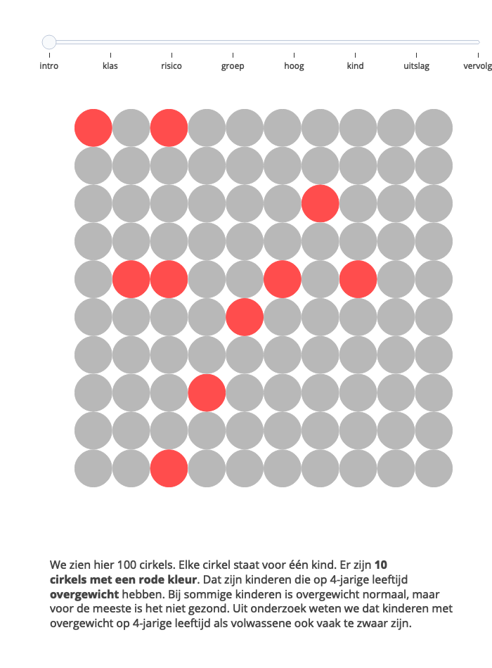
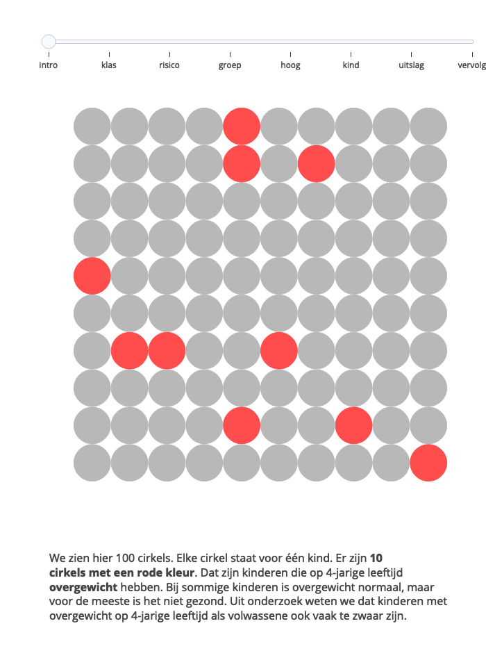

<!-- README.md is generated from README.Rmd. Please edit that file -->

# tab10

<!-- badges: start -->
<!-- badges: end -->

The goal of `tab10` is to support risk communication. Many people
struggle with the interpretation of probability. This package develops a
new interactive graphical instrument, the **Table of Ten**, to ease
gaining insight into personal risk probabilities. The goals of the
method are to communicate

1.  the prevalence of a future outcome;
2.  the rank of the person’s predicted probability relative to other
    people;
3.  the positive predictive value of the prediction;
4.  the effect of “doing something” versus “doing nothing”.

Not every goal has yet been achieved. Most of the developments in the
present package relate to points 1, 2 and 3.

## Installation

You can install the development version of tab10 like so:

``` r
remotes::install_github("growthcharts/tab10")
```

## Example overweight

This is a basic example to communicate the probability of getting
overweight at the age of 4 years, given data of infants aged 6-12
months.

``` r
library(tab10)
fig <- create_tab10(palet = "redshadow")
fig
```



GitHub README does not allow animation. Install and run the above code
locally.

## Example preterm birth (GA \< 37 weeks)

``` r
library(tab10)
fig <- create_tab10(name = "preterm-37w-1", palet = "redshadow")
fig
```



## Shiny app

The Shiny app implements models to predict

- overweight at age 4 years from data at age 4 months;
- language deficit at age 4 years from data at age 2 years;
- preterm birth (\<32 weeks) at week 16-20 of pregnancy.

To run the Shiny app background in RStudio viewer, select the file
`shiny/shiny-run.R` in editor, in tab “Background Jobs” press “Start
Background Job”, check that “script path” ends in `shiny/shiny-run.R`
and that “working directory” is `shiny`, then press `Start`. Go to
Console and run

``` r
rstudioapi::viewer("http://127.0.0.1:4276")
```

You can then see live changes made in `shiny/app.R` in the viewer.
